# JL701N 写卡小板使用说明

> 杰理（JieLi）音频导出工具：用于采集杰理音箱 / 耳机经串口输出的音频数据包，保存到 SD 卡后，由电脑端工具解析为 `.raw` 裸数据文件，再分别对各个声道进行音频分析。

软件版本：`v202504015`

---

## 目录

- [功能简介](#功能简介)
- [硬件说明](#硬件说明)
- [显示屏说明](#显示屏说明)
- [按键说明](#按键说明)
- [打印说明（无显示屏时使用）](#打印说明无显示屏时使用)
- [电脑端导出数据](#电脑端导出数据)
- [FAQ](#faq)

---

## 功能简介

本工具用于在脱离电脑环境的情况下，采集杰理音箱 / 耳机经串口输出的音频数据包，工作流程如下：

1. **音频数据采集**：杰理音箱 / 耳机通过串口（UART）把音频数据包发送出来，小板实时接收并写入 SD 卡的 `dbg_xxx.bin` 文件
2. **状态提示**：通过 OLED 显示屏或串口打印反馈当前工作状态（波特率、通道数、丢包次数等）
3. **数据解析**：在电脑端运行 `rwsp.bat` 脚本，把 `dbg_xxx.bin` 解析为 `0.raw`、`1.raw`、`2.raw` 等多个裸数据文件，每个 `.raw` 对应一个声道
4. **音频分析**：使用 Adobe Audition 按数据实际的位宽、采样率、声道数打开 `.raw` 文件，分别分析各声道音频质量

---

## 硬件说明

### 串口与 LED

| 项目               | 引脚  | 说明                       |
| ------------------ | ----- | -------------------------- |
| 串口写卡接收引脚   | PA3   | 接收待写入 SD 卡的数据     |
| 写卡小板打印引脚   | PB5   | 波特率：`2000000`          |
| 写卡提示 LED 引脚  | PB2   | 正常写卡时闪烁提示         |

### 显示屏 OLED 引脚

| 引脚 | 说明 |
| ---- | ---- |
| CLK  | PA8  |
| DAT  | PC2  |
| RST  | PC3  |
| DC   | PC4  |
| CS   | PC5  |

### 1 线 SD 卡引脚

| 引脚     | 说明 |
| -------- | ---- |
| SDPG     | PE6  |
| SD_SMD   | PG1  |
| SD_CLK   | PG2  |
| SD_DATA0 | PG0  |

### ADKEY 按键电阻

ADKEY 引脚为 PB1，需外接 **22 kΩ 上拉电阻**。

| 按键 | 电阻值 |
| ---- | ------ |
| PP   | 33 kΩ  |
| PREV | 51 kΩ  |
| NEXT | 100 kΩ |

---

## 显示屏说明

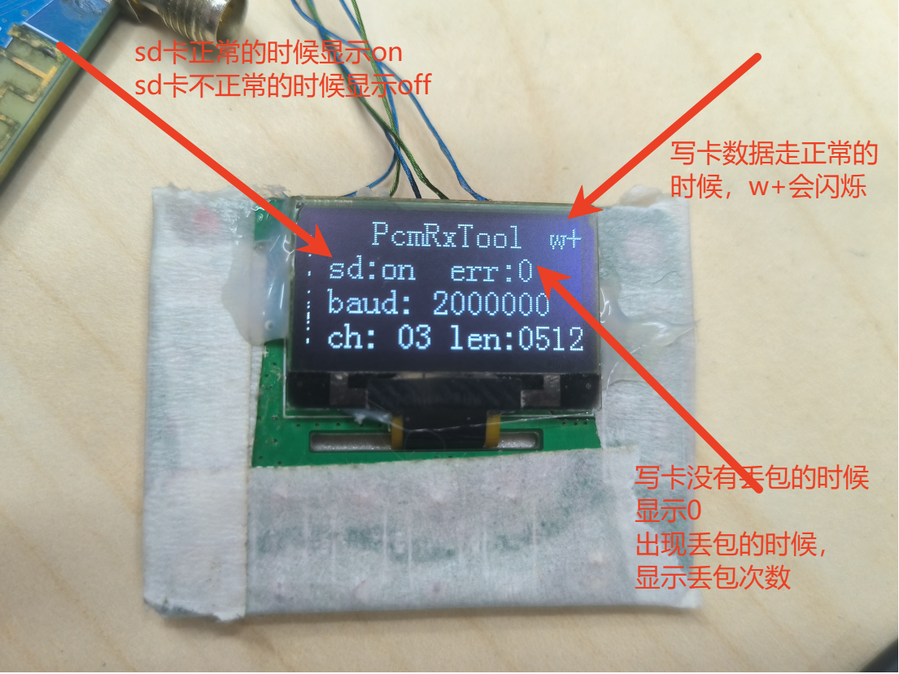

| 显示项    | 说明                                               |
| --------- | -------------------------------------------------- |
| PcmRxTool | 标题                                               |
| w+        | 数据正常写进 SD 卡的时候会闪烁提示                 |
| sd        | SD 卡正常时显示 `on`，不正常时显示 `off`           |
| err       | 写卡没有丢包时显示 `0`，有丢包时显示丢包次数        |
| baud      | 写卡串口波特率                                     |
| ch        | 写卡通道数                                         |
| len       | 单个写卡通道的数据长度                             |
| Led       | 数据正常写进 SD 卡的时候会闪烁提示                 |

---

## 按键说明

小板支持通过按键修改接收通道数、单通道数据长度和串口接收波特率。

**默认配置：**

- 通道数：`3` 个
- 单通道数据长度：`512` byte
- 波特率：`2000000`

> 提示：所有按键修改均需 **重启程序后生效**。

### （1）修改串口接收波特率

1. 单击 **3 次** p/p 按键 → 进入波特率修改
2. 通过 `NEXT` / `PREV` 按键加减接收的波特率
3. 单击 **1 次** p/p 按键 → 退出设置

### （2）修改接收通道数

1. 单击 **1 次** p/p 按键 → 进入通道数修改
2. 通过 `NEXT` / `PREV` 按键加减通道数
3. 单击 **3 次** p/p 按键 → 退出设置

### （3）修改单个通道支持的数据长度

1. 单击 **2 次** p/p 按键 → 进入数据长度修改
2. 通过 `NEXT` / `PREV` 按键加减可接收的数据长度
3. 单击 **2 次** p/p 按键 → 退出设置

---

## 打印说明（无显示屏时使用）

> 在没有 OLED 显示屏的情况下，可通过串口打印查看小板状态。打印波特率为 `2000000`。

### （1）开机后打印串口波特率、通道数和通道长度

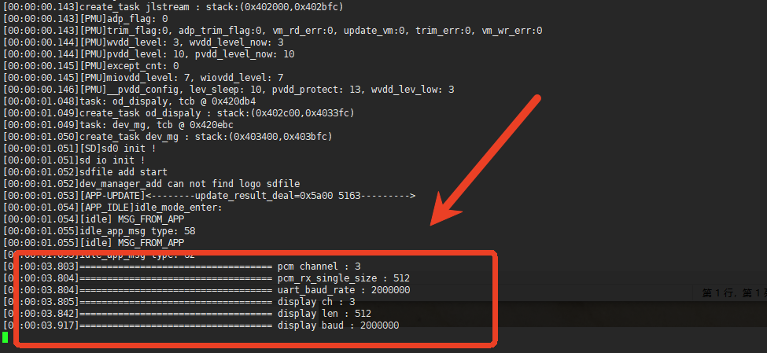

### （2）插入 SD 卡后的打印

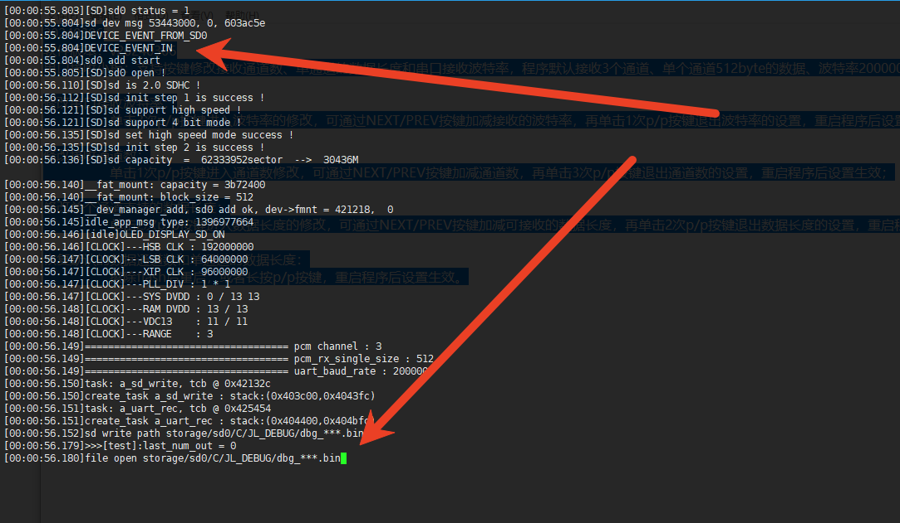

### 拔出 SD 卡的打印

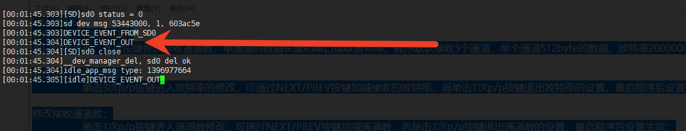

### 写卡正常时打印 `RW`

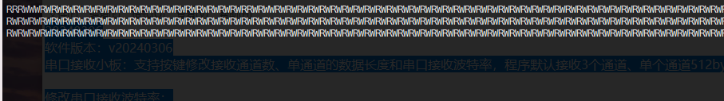

### 写卡异常时的打印

异常时串口会输出以下信息之一：

```text
[error] sd cbuf full
uart crc err
uart recv read err,
[error] sd write err
```

### 按键设置时的打印

#### 设置 ch：

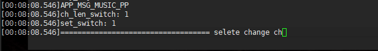

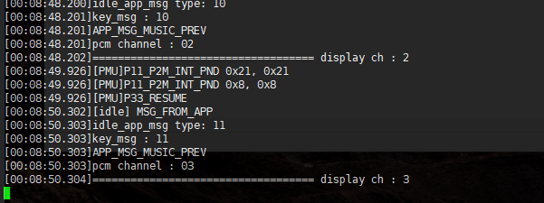

#### 设置 len：

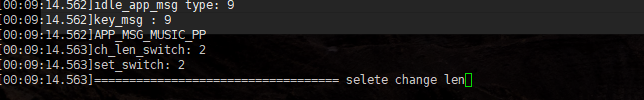

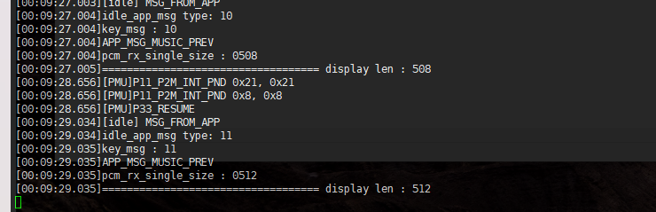

#### 设置 baud：

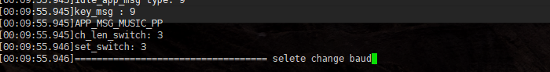

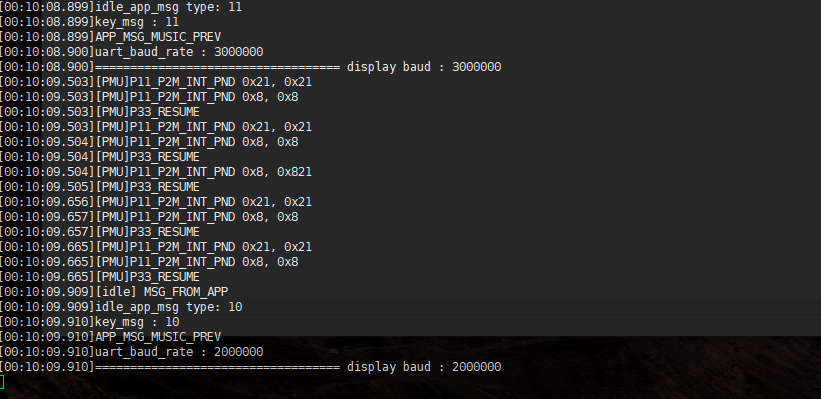

#### 设置参数完成：

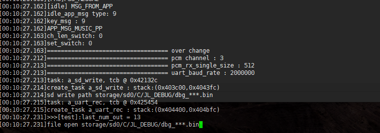

---

## 电脑端导出数据

串口接收到的数据会保存在 SD 卡的 `JL_DEBUG` 目录下的 `dbg_xxx.bin` 文件里，需要使用电脑端工具把 `dbg_xxx.bin` 的数据解析出来。

### 操作步骤

#### （1）打开 SD 卡的 `JL_DEBUG` 目录

查看刚刚写卡生成的数据文件是哪个，一般是 **序号最大** 的那个。

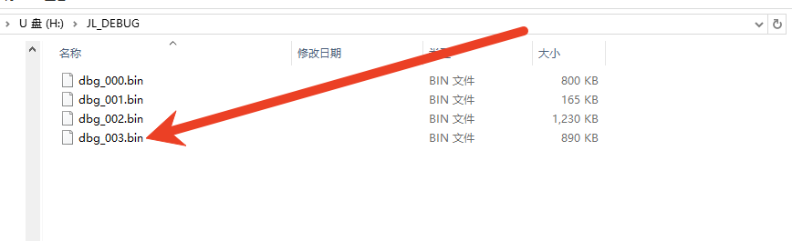

#### （2）双击打开电脑工具的 `rwsp.bat` 脚本

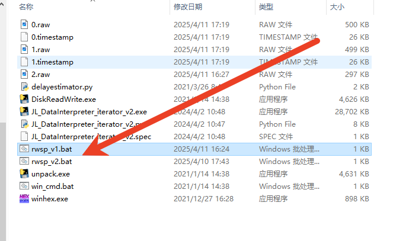

#### （3）输入 SD 卡的盘符，然后按回车键

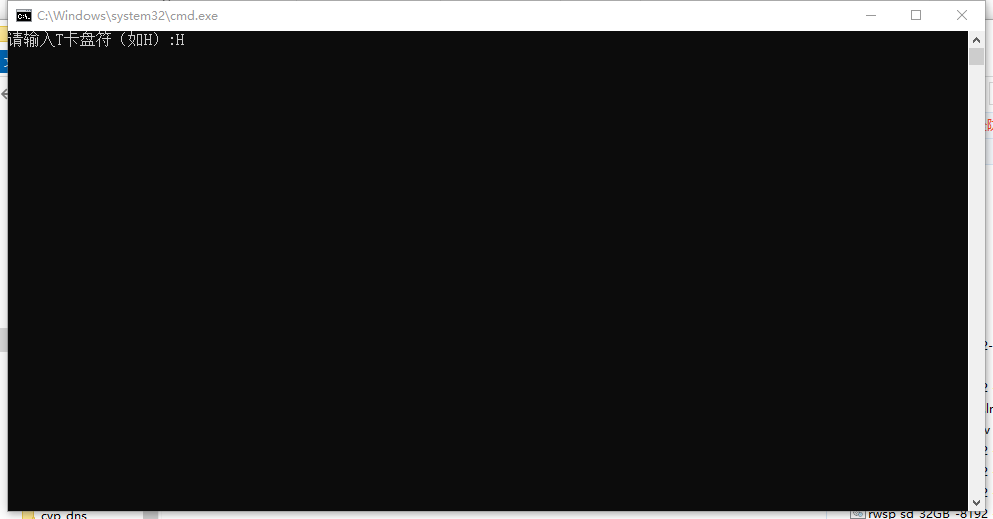

#### （4）输入写卡生成的文件序号，然后按回车键

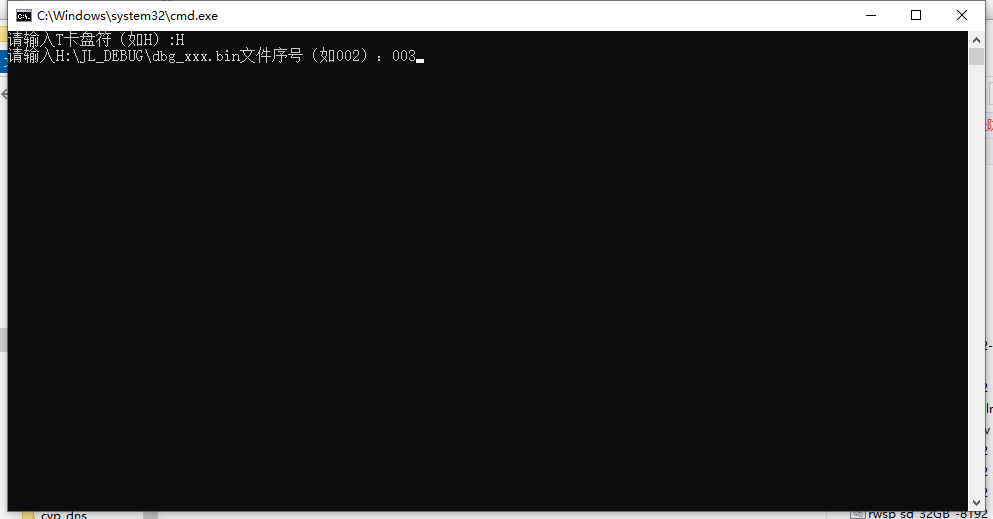

#### （5）输入写卡小板显示的 `ch` 值，然后按回车键

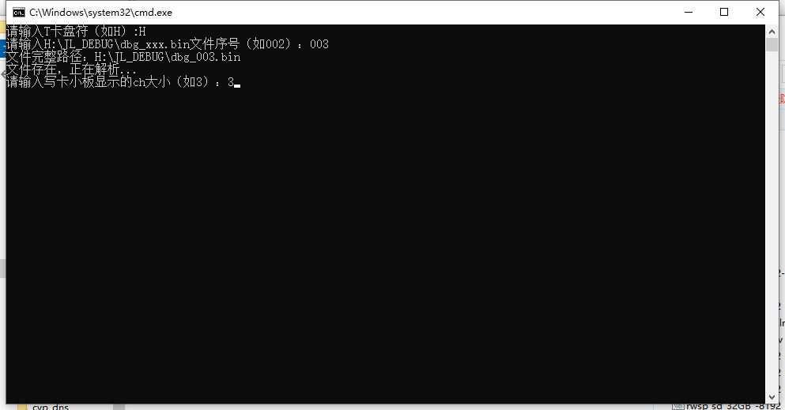

#### （6）输入写卡小板显示的 `len` 值，然后按回车键

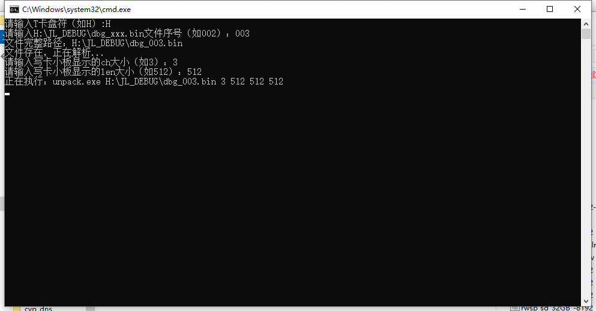

#### （7）查看导出结果

`rwsp_v1.bat` 版本（通话写卡）导出数据正常显示如下：

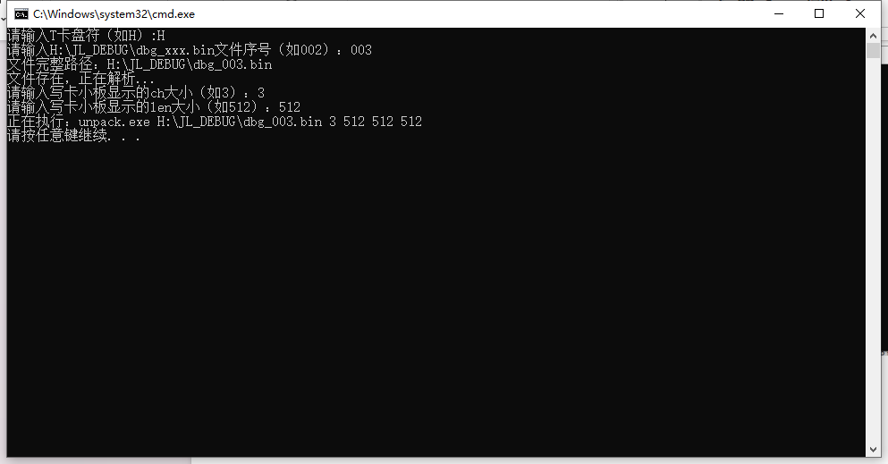

`rwsp_v2.bat` 版本（写卡节点）导出数据正常显示如下：

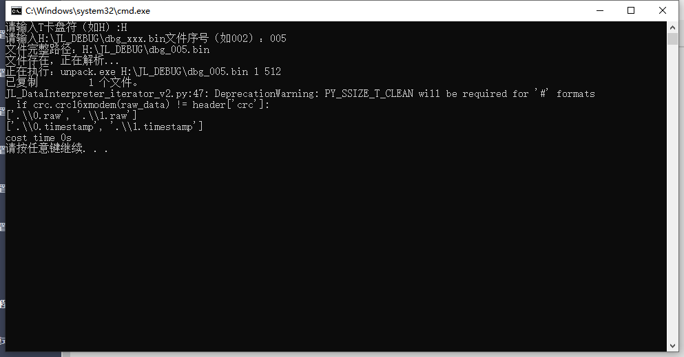

最后会在工具目录下解析出 `0.raw`、`1.raw`、`2.raw` 等裸数据文件：

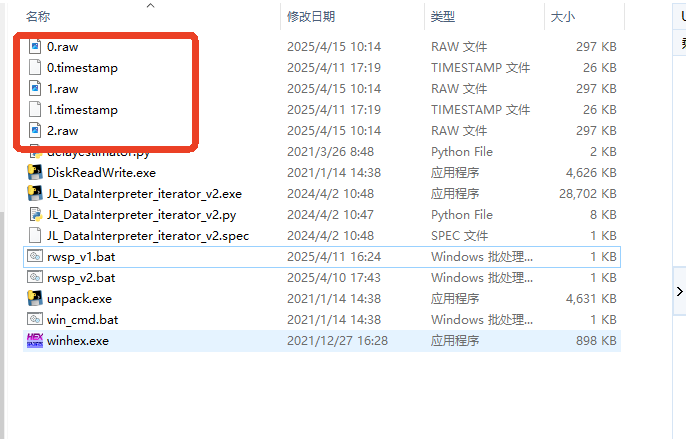

#### （8）使用 Adobe Audition 打开 `.raw` 文件

在电脑端使用 Adobe Audition，根据数据实际的 **位宽、采样率、声道数** 打开 `.raw` 文件查看波形。

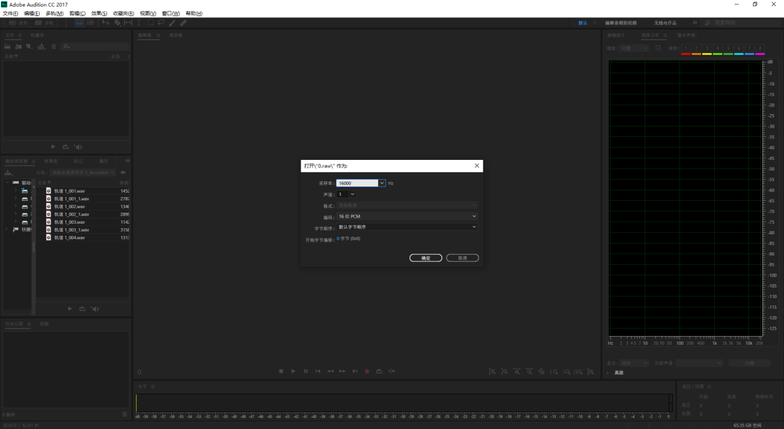

---

## FAQ

**Q1：按键修改参数后为什么没有生效？**
A：所有按键修改均需重启程序后才会生效。

**Q2：OLED 显示 `sd: off` 是什么意思？**
A：表示 SD 卡未正常识别，请检查 SD 卡是否插好或换一张卡测试。

**Q3：`err` 显示非 0 数字怎么办？**
A：表示写卡过程中出现丢包，数字为丢包次数。建议降低波特率或检查 SD 卡写入性能。

**Q4：导出的 `.raw` 文件在 Audition 中打开是噪声？**
A：请确认在 Audition 中按数据实际的 **位宽、采样率、声道数** 打开，参数与小板配置不一致时会出现噪声。

**Q5：哪个文件是最新生成的数据文件？**
A：在 `JL_DEBUG` 目录下，序号最大的 `dbg_xxx.bin` 即为最新生成的数据文件。
